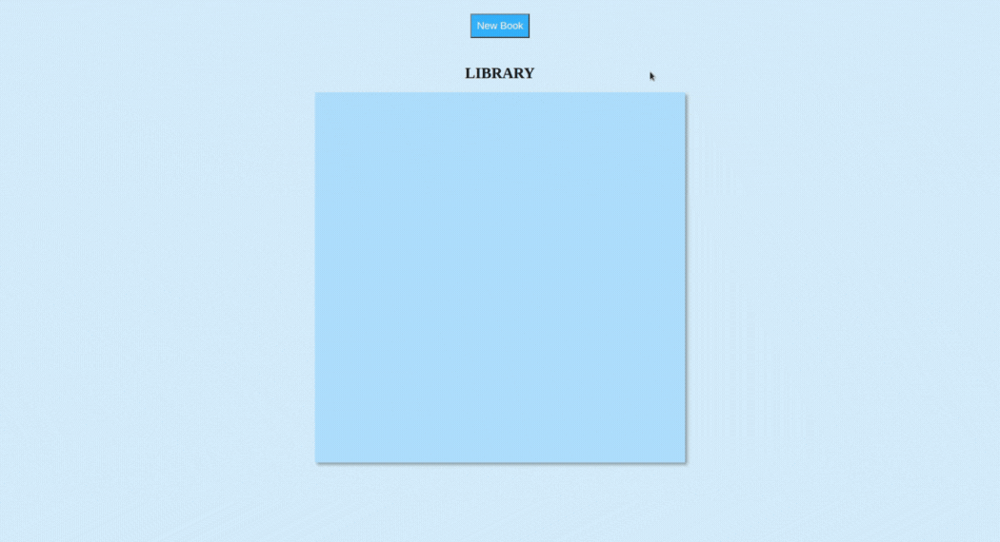
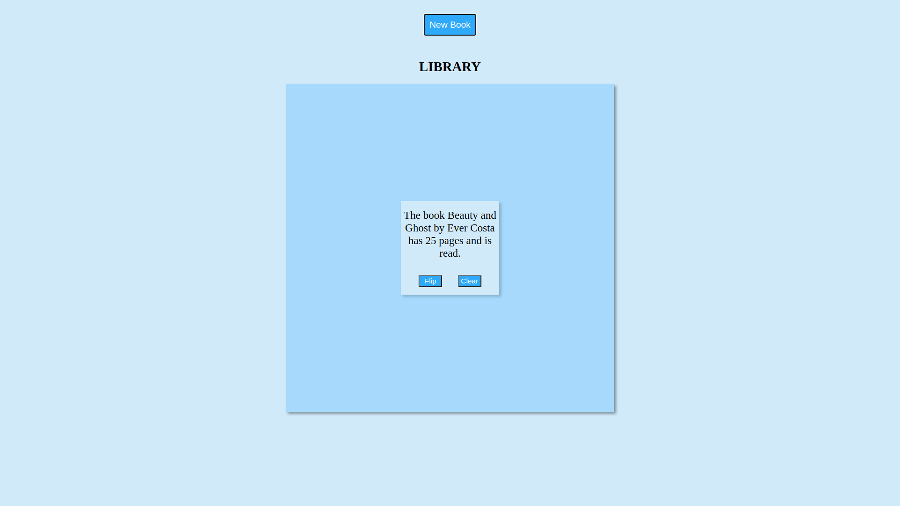

# Library

    <h3>💻 Languages</h3>
    
    
    
    <h3>🔧 Technologies</h3>
    
    
    
    <h4><a href="https://asdacosta.github.io/library/">Live Preview</a></h4>

**Demo:**

**
Screen views
**

**Desktop View:**

 

**Mobile View:**

## 🌐 Origin
[The Odin Project](https://www.theodinproject.com/)

## 📝 Description
Builds a library

Features

* Adds only non-empty books to the library.
* Library takes a maximum of nine books.
* Delete a book from the library with `Clear` button.
* Alternate a given book as 'Read' or 'Not read' with `Flip` button.

## 🎯 Relevance
To solidify concepts of `Objects & Objects Constructors` in JavaScript. 

## 👥 Intended Audience
Developers, users, recruiters.

## 📂 Files

Invert

| File | Description |
| - | - |
| `index.html` | Sets structure of display. |
| `style.css` | Style website. |
| `index.js` | Add interactivity. |
|`view-imgs/*`| Live demo and different screen views used in `README.md`.|

## ©️ Credit

Invert

No assets used.

## 🔄 Improvements

Invert

- [ ] Add an appealing background image
- [ ] Let books be added from top-left
- [ ] Add local storage for books added.
- [ ] User should be able to exit dialog.

## 👤 Contributor & Curator
1. [Abraham Da Costa Silvanus](https://github.com/asdacosta) 

 

> [!IMPORTANT]
> Seek contributor's consent for any code usage.

**[🞁 Top](#library)**